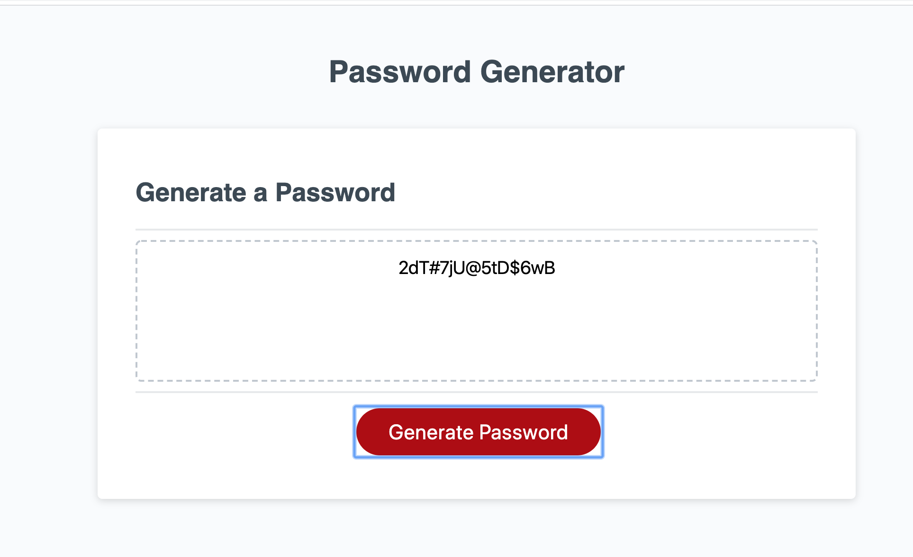
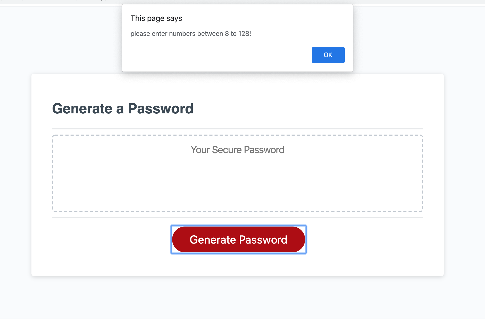

# Password-Generator
I build this random password generator using javascript, which makes it possible to choose random-function. It  creates passwords base on the users selection of password length between 8 to 128 using combinations of characters, numbers and symbols and if the users . 

 

